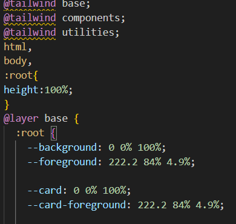

## 设置globals.css

插入

```css
html,
body,
:root{
height:100%;
} 
```

 

??? note "为什么?"

    在CSS中，`html`, `body`, 和 `:root` 选择器通常用来选择HTML页面的最顶层元素。
    
    这里的代码：
    
    ```css
    html,
    body,
    :root {
      height: 100%;
    }
    ```
    
    意味着给HTML文档的 `<html>` 元素、`<body>` 元素以及`:root`伪类（在HTML中`:root`通常指的是`<html>`元素）设置了一个高度，让它们的高度都是100%。这里的100%是相对于它们各自的包含块 —— 通常是浏览器视窗的高度。这种设置可以确保页面的根元素和主体元素的高度至少和视窗一样高，这是创建全屏网页布局的一种常见做法。
    
    这样设置的目的通常是为了能够在页面中使用基于百分比的高度值，这样子元素就可以根据父元素的高度来设置自己的高度。如果不设置这些元素的高度，子元素的百分比高度将没有效果，因为默认情况下，`<html>` 和 `<body>` 的高度仅由它们包含的内容决定。通过设置这些元素的高度为100%，可以让它们的子元素使用百分比来定义自己的高度。

## 设置路由组Route Groups

[Routing: Route Groups | Next.js (nextjs.org)](https://nextjs.org/docs/app/building-your-application/routing/route-groups)

需求：自己本地的代码文件目录结构保持分类的形式，有条理，但不需要把目录的名字作为路由。

给文件名加上`()`


## 使用代码片段快速创建

在Visual Studio Code中，你以创建自定义的代码片段（snippets）。这样，你可以通过输入一个简短的缩写来生成一个预先定义的组件模板。

下面是如何在Visual Studio Code中创建代码片段的一个例子：

1. 在Visual Studio Code中，打开**用户代码片段**（通过按下 `F1` 或 `Ctrl+Shift+P` 然后搜索`Preferences: Configure User Snippets`）。

2. 选择`typescriptreact.json`（针对TSX文件）。

3. 定义你的代码片段。例如：

```json
{
	"React Functional Component": {
	  "prefix": "sfc",
	  "body": [
		"const $1 = () => {",
		"  return (",
		"    $0",
		"  );",
		"};",
		"",
		"export default $1;"
	  ],
	  "description": "React Stateless Functional Component"
	}
  }
  
```

4. 保存并关闭代码片段文件。

现在，每当你在`.tsx`文件中输入`sfc`并按下`Tab`键时，它都会生成一个函数式组件的模板，你可以替换`$1`为你的组件名，`$0`将是光标最终的位置。这将大大提高创建新组件的效率。